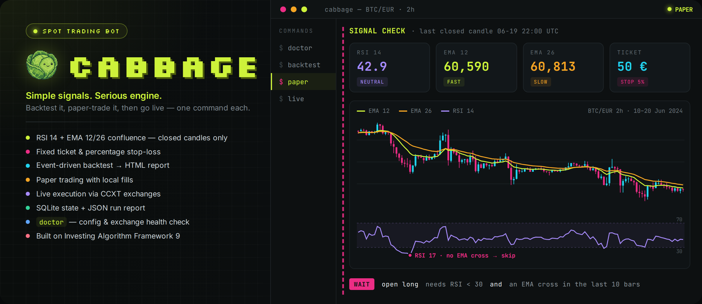

<p align="center">
  
</p>

# CABBAGE

CABBAGE built directly on **Investing Algorithm Framework 9.0.0a18**.
The original framework is the runtime, not an unused vendored dependency.

[Русская инструкция → START-HERE-RU.md](START-HERE-RU.md)

## Architecture

`CabbageStrategy → original signal/risk pipeline → original order service →
CCXTOrderExecutor (live) or PaperTradingOrderExecutor (paper) → original
portfolio/trade services → SQLite + RunReport`

The full upstream Python package, original strategies/examples, tests and data,
documentation, native sources and license are included. The original README is
[UPSTREAM-README.md](UPSTREAM-README.md). No simplified replacement engine is used.

## Install (Python 3.12 recommended)

From the repository root:

```sh
python -m venv .venv
# Windows cmd: .venv\Scripts\activate
# macOS / Linux: source .venv/bin/activate
python -m pip install -r requirements-cabbage.txt
```

Copy `.env.example` to `.env` and edit your settings. Never commit `.env`.

## Commands

```sh
python -m cabbage doctor                 # inspect configuration, no orders
python -m cabbage doctor --online        # check public exchange data, no orders
python -m cabbage backtest               # offline, original event-driven engine
python -m cabbage paper --iterations 1   # one paper iteration using exchange data
python -m cabbage paper                  # continuous original paper runtime
python -m cabbage live                   # REAL exchange execution with your keys
```

`live` is the explicit real-order command. It requires the selected exchange's
`{MARKET}_API_KEY` and `{MARKET}_SECRET_KEY`. Exchange/account support, permissions,
pair availability, venue order minimums and sufficient balances remain necessary.
The CABBAGE wrapper currently supports spot pairs requiring key/secret auth.
The upstream framework retains its full extension APIs for other integrations.

## What this strategy does

It reuses the upstream RSI/EMA crossover strategy from `examples/simple_app.py`.
The CABBAGE configuration uses long-only spot entries/exits, a fixed quote-currency
ticket, a fixed percentage stop, and excludes incomplete candles. It does not use
Jev or score smart-money wallets. No calibrated 80% model probability is invented.

Default configuration reproduces an upstream market/pair: BITVAVO, BTC/EUR,
2-hour candles, 50 EUR entry ticket, 5% stop, paper initial balance 1000 EUR,
0.25% configured fee. These are software defaults, not investment recommendations.
A valid entry is conditional; a run may legitimately produce no orders.
The signal schedule cannot be faster than the candle timeframe, per upstream.

Stop management is provided by the original framework. Stops are not guaranteed
exchange-side orders or guaranteed fill prices; stopping the bot can interrupt
client-side protection. The original limit execution can leave orders pending.

## Data and state

State is separated by mode, market and pair under `runtime/`. The framework
persists its database and run reports there. A bounded run or normal shutdown
also exports `latest-run.json` from the actual framework report. No promotional
P&L is preloaded. Do not run two processes against the same state directory.

The bundled offline backtest uses original BTC/EUR candles from June 2024.
It writes an HTML report and the framework's native backtest artifacts under
`runtime/backtest/bitvavo/BTC-EUR/`. It is an integration check, not a profitability
claim or a recreation of the supplied +$6,400 narrative.

## Tests

```sh
python -m unittest discover -s cabbage_tests -v
python -m unittest tests.app.test_paper_trading -v
```

See [VALIDATION.md](VALIDATION.md) for actual results and limits. The complete
upstream suite is preserved but has not all been executed for this delivery.

## Still absent from the supplied upstream

- Robinhood Chain RPC/DEX wallet scanner and signing/execution adapter.
- Jev inference API implementation.
- The promotional smart-wallet strategy and independently verified trade history.

This delivery preserves and uses the actual exchange-trading functionality in
the source you supplied. It does not claim the above integrations exist.

## Provenance

Upstream: https://github.com/coding-kitties/investing-algorithm-framework
Commit: `fff7436f12ea95a2e5f794ce6800663fc21ef8ec`.
Original license and authors: [LICENSE](LICENSE), [AUTHORS.md](AUTHORS.md).
CABBAGE-specific additions are in `cabbage/`, `cabbage_tests/`, launcher/setup
files and this README. Upstream publishing workflows are preserved as disabled
reference files under `.github/upstream-workflows/`; CABBAGE's workflow runs tests.
